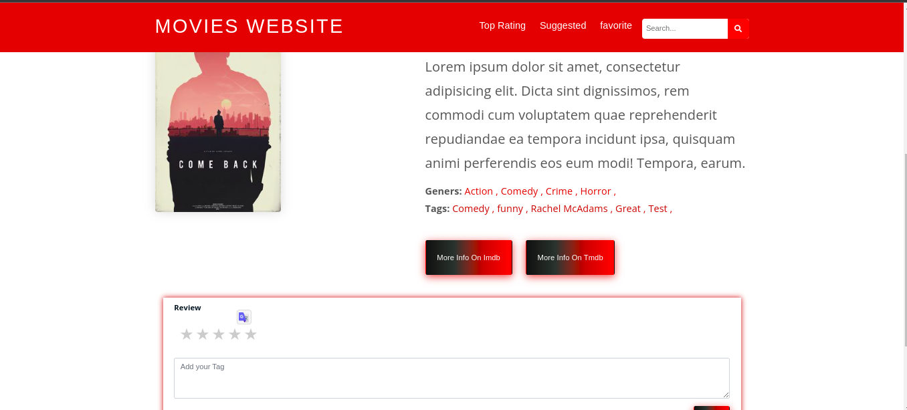

# Movie Recommendation system 
A webstie that user must sign-up ot see the latest movies and thier ratings and user can rate movies and add tags
so he would get suggestions depening on his ratigns , using -apriori- algorithm.

## How to use
1. Run git clone ```bash <https://github.com/mhammad-bazzarah/movieRecommendation.git> ``` to clone the repository.
2. Run ```bash composer install ``` to install composer dependency.
3. Copy .env.example To .env and edit the database credential there.
4. Run ```bash php artisan key:generate ``` to generate an app encryption key.
5. Run ```bash php artisan migrate --seed ``` To migrate the database. 
6. Run ```bash php artisan serve ``` 
7. Go to link localhost:8000

## Screen Shots



